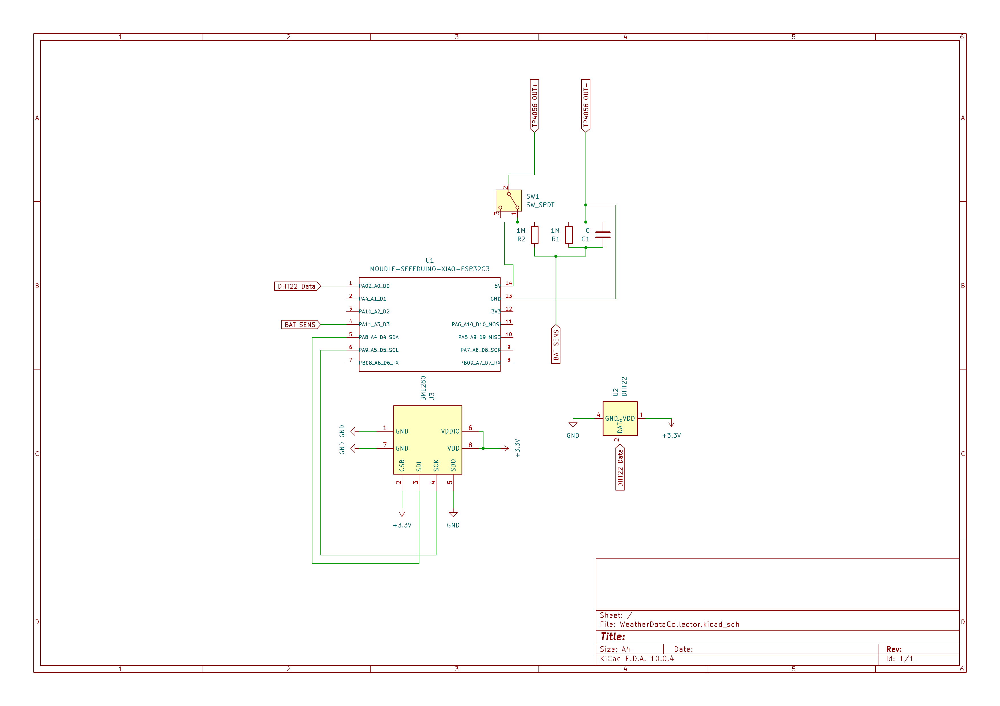

# Weather Data Collector

A local weather data collector that aims to be low-power and self-sustaining. It utilizes the **BMP280** and **DHT22** sensors to provide moderately accurate temperature, pressure, and humidity readings. Those readings are sent in batches in configurable intervals to a locally hosted flask server that pushes them to a sqlite database and can be accessed later on for data processing.


## Getting Started: Wiring Diagram

You will need the following components:

|Component|Quantity|Notes|
|---------|--------|-----|
|ESP32 C3 supermini|1|Can be substituted for any other low power wifi capable mcu|
|BMP280 sensor module|1|A better pick is the BM**E**280 which is capable of measuring temperature, humidity, and pressure|
|DHT22|1|Used to measure humidity and a second temperature reading|
|Switch|1|Anything that can turn the power on/off|
|1M ohm resistor|2|For the voltage divider|
|100nF ceramic capacitor|1|Used in the voltage divider|
|65x65 solar panel|4|Or anything that can charge the battery|
|TP4056 charging module|1|For battery protection|
|18650 3.7v battery|1|Powers up the system|
|18650 battery holder|1| - |


<p align="center">
    
    </br>
    <small>Seeed XIAO ESP32 C3 is used in the diagram instead of the supermini.</small>
</p>

Note that an array of solar panels are wired in parallel to the TP4056 charging module input.


## Getting Started: Server

Server code located under `/server` can be hosted on a wide range of systems including but not limited to a VPS or even locally. 

For this project I decided to host this server locally on a machine running Ubuntu Server. I have the following systemd service setup to automatically start the server whenever the machine boots up:
```
[Unit]
Description=Starts the weather collector server
After=network.target
Wants=network-online.target

[Service]
Restart=always
Type=simple
WorkingDirectory=/home/<user>/weather-data-collector/server
ExecStart=/home/<user>/weather-data-collector/server/.venv/bin/python /home/<user>/weather-data-collector/server/server.py
User=<user>
Environment=

[Install]
WantedBy=multi-user.target
```
Replace every `<user>` instance with your user. 
The above script lives under `/etc/systemd/system/weather-server.service`. After creating the service file, run the following to start the service:
```
sudo systemctl daemon-reload
sudo systemctl enable --now weather-server
```
And to check the status of the service:
```
systemctl status weather-server
```